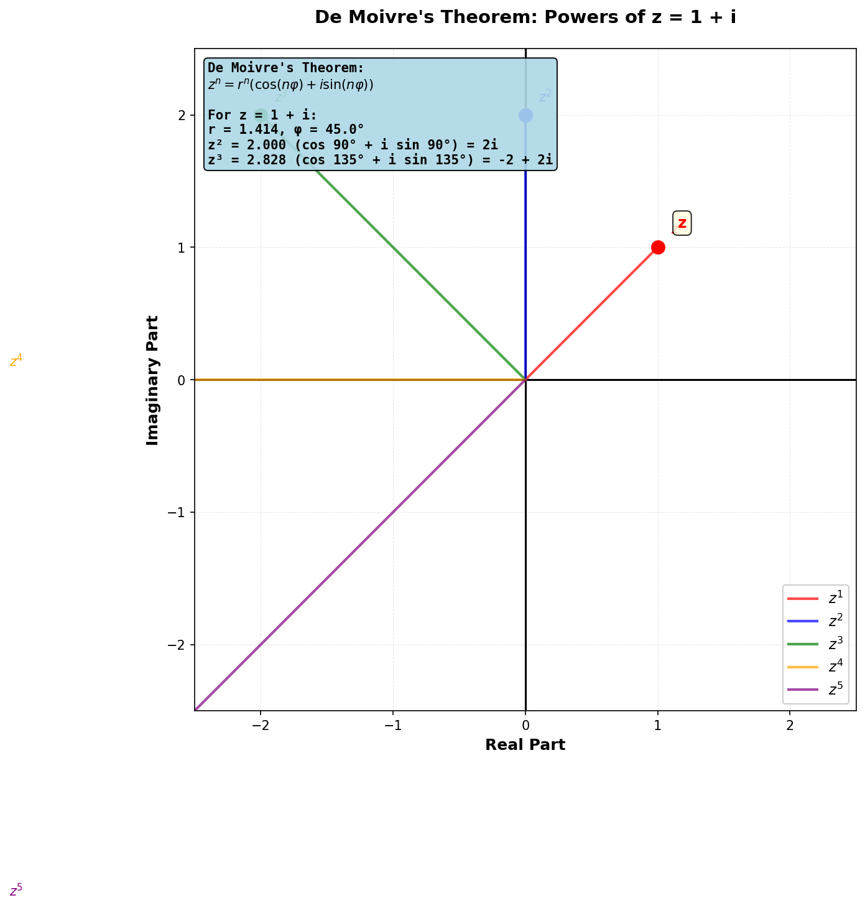
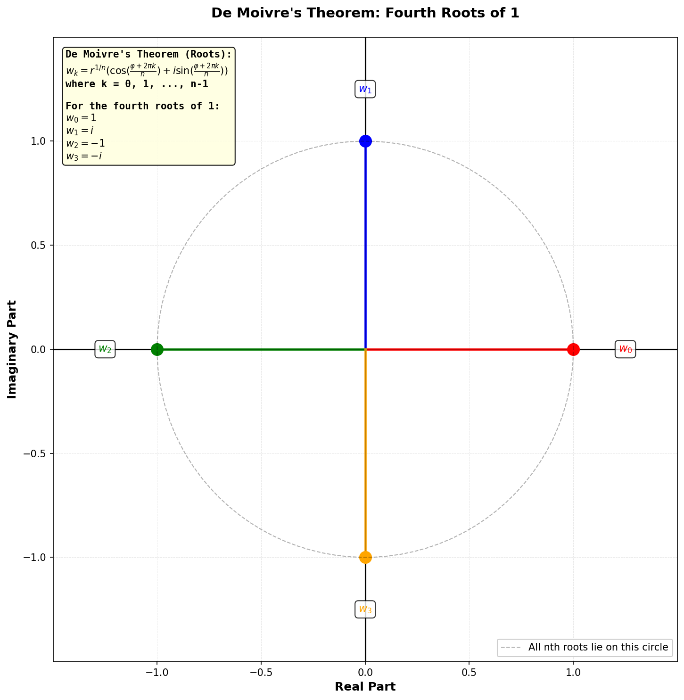

# De Moivre's Theorem

**De Moivre's Theorem** is a powerful tool for computing integer powers and roots of complex numbers when they are expressed in polar form. It states that for a complex number in polar form and any integer $n$:

$$
[r(\cos \phi + i \sin \phi)]^n = r^n(\cos(n\phi) + i \sin(n\phi))
$$

In exponential notation, this becomes:

$$
(r e^{i\phi})^n = r^n e^{in\phi}
$$

This theorem makes computing powers and roots much simpler than expanding them algebraically in rectangular form.

# Computing Integer Powers

To compute $z^n$ where $z$ is in polar form:

1. Express $z = r(\cos \phi + i \sin \phi)$
2. Raise the modulus to the $n$-th power: $r^n$
3. Multiply the argument by $n$: $n\phi$
4. Write the result: $z^n = r^n(\cos(n\phi) + i \sin(n\phi))$

**Example:** Let $z = 1 + i$. Then $r = \sqrt{2}$ and $\phi = 45°$.

$$
z^2 = (\sqrt{2})^2 (\cos 90° + i \sin 90°) = 2i
$$

$$
z^3 = (\sqrt{2})^3 (\cos 135° + i \sin 135°) = 2\sqrt{2} \left(-\frac{\sqrt{2}}{2} + i\frac{\sqrt{2}}{2}\right) = -2 + 2i
$$

# Computing Roots

De Moivre's theorem also applies to fractional exponents. The $n$-th roots of a complex number are:

$$
w_k = r^{1/n}\left(\cos\left(\frac{\phi + 2\pi k}{n}\right) + i \sin\left(\frac{\phi + 2\pi k}{n}\right)\right)
$$

where $k = 0, 1, 2, \ldots, n-1$.

Key observations:

- **Multiple roots:** A complex number has exactly $n$ distinct $n$-th roots (unlike real numbers, which typically have one or two).
- **Equal spacing:** The $n$ roots are evenly distributed around a circle of radius $r^{1/n}$ centred at the origin, with angular spacing of $\frac{2\pi}{n}$ radians (or $\frac{360°}{n}$ degrees).
- **Index $k$:** The index $k$ determines which of the $n$ roots you compute. Different values of $k$ give different roots.

**Example:** The fourth roots of 1 are:

$$
w_0 = 1, \quad w_1 = i, \quad w_2 = -1, \quad w_3 = -i
$$

These four roots are evenly spaced around the unit circle at $90°$ intervals.

# Why This Matters

Using De Moivre's theorem to compute powers and roots is far simpler than expanding them algebraically. For instance, computing $(1 + i)^{10}$ by repeated multiplication would be tedious, but using De Moivre's theorem:

$$
(1 + i)^{10} = (\sqrt{2})^{10} (\cos 450° + i \sin 450°) = 32(\cos 90° + i \sin 90°) = 32i
$$

The theorem is particularly useful in applications such as electrical engineering (AC circuit analysis) and physics, where complex exponentials and powers appear frequently.
